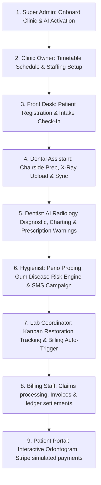

# HMS CoreSaaS: Live Frontend Role-Based Testing, Architecture & Deep-Dive Flow Guide

Welcome to the **HMS CoreSaaS** Complete Flow Guide. Yeh guide poore application ke React + Zustand structure ko real-world scenarios, step-by-step role capabilities, menus, buttons, aur dynamic store synchronizations ke sath **Hinglish** (Hindi-English mix) me detail me samjhati hai.

---

## 🎯 SECTION 1: System Architecture & Tech Stack Overview

Platform ko build karte samay production-ready, modular aur role-based security aspects ko primary focus banaya gaya hai.

### ⚙️ Core Stack & Folder Mapping:
* **Framework**: React.js (Vite configuration ke sath, fully **JavaScript (NO TypeScript)**).
* **State Management**: **Zustand** stores (har role ke liye dynamic modular states and action definitions, stored under `/src/store/`).
* **Routing**: **React Router DOM v6+** (Dynamic layout wrapper routing aur `ProtectedRoute` file routing control).
* **Permissions Engine**: `/src/shared/utils/permissions.js` me role permissions aur routes allowed lists configuration hai.
* **Component Design**: Stripe-inspired aur Notion-inspired simplicity aesthetic (vibrant HSL colors, responsive grids, dark/light settings, skeleton loaders, and toast alerts).

---

## 🌟 SECTION 2: Real-World Case Study (James Carter's Treatment Journey)

SaaS platform ke pure system flow ko samajhne ke liye hum **James Carter (Patient ID: `pat-1`)** ka real-world end-to-end simulation example use karenge. Is sequence me har role kaise operate karta hai, use neeche step-by-step samjhaya gaya hai:

---

### Step 1: Super Admin (Sarah Jenkins) - Clinic Onboarding & AI Licensing
* **Autofill User**: `s.jenkins@hms-saas.com`
* **Real-world Example**: Sarah Jenkins Metropolitan Dental Care clinic (Seattle location) ko platform par onboarding aur license activation karti hai.
* **Flow & Action Actions**:
  1. Sarah `/super-admin/clinics` me jaakar **Add New Clinic** par click karti hai aur `Metropolitan Dental Care` register karti hai with *Enterprise Plan* ($499/mo).
  2. Phir Sarah `/super-admin/ai` settings page par jaati hai. Metropolitan clinic ke matching toggles ko locate karti hai aur **Radiograph Diagnostic Auditing** aur **Recall SMS Automation** features enable karti hai.
  3. Sarah database syncing confirm karne ke liye **Replication Trigger Button (Database Sync)** tap karti hai. Action complete hone par platform top bar me status green alert display karta hai.

---

### Step 2: Clinic Owner (Dr. Arthur Vance) - Team Staffing & Timetables Scheduling
* **Autofill User**: `owner@vancedental.com`
* **Real-world Example**: Dr. Arthur Vance clinic owner Seattle branches me staff setup aur calendar timetable configuration perform karte hain.
* **Flow & Action Actions**:
  1. Dr. Vance `/clinic/staff` me jaakar **Add Staff Member** click karte hain aur dentist profile (`Dr. Michael Chen`, role `dentist`) aur assistant profile (`David Miller`, role `dental_assistant`) register karte hain.
  2. Phir `/clinic/appointments` me schedule configure karne ke liye tab shift karte hain. 
  3. **Daily Time-Slot Grid** view choose karte hain. `2026-06-08` calendar date select karte hain. 09:00 AM slot khali dikhta hai. Slot par tap karne par automatic reservation form fill open hota hai. Yahan **James Carter** ko register patient dropdown se select karte hain aur **Teeth Cleaning** treatment assign karke reservation list submit karte hain.

---

### Step 3: Front Desk (Amara Lopez) - Patient Intake & Coverage Clearance
* **Autofill User**: `amara.reception@vancedental.com`
* **Real-world Example**: James Carter appointment ke liye clinic front reception par pahunchte hain.
* **Flow & Action Actions**:
  1. Amara `/frontdesk/dashboard` par intake queues check karti hain. James Carter roster me list hote hain with status `Waiting`. Amara check-in action verify karne ke liye status drop-down toggles se **Arrived** choose karti hain.
  2. Insurance approval ke liye Amara `/frontdesk/insurance` page me jaati hain aur **Check Coverage Eligibility** button par tap karti hain. Screen instantly success tag display karti hai: *"Eligibility Approved: Policy is ACTIVE, dental restoration coverage limit $2,500/yr."*
  3. Naye walk-in patients ke liye Amara `/frontdesk/registration` me naye profiles submit karti hain.

---

### Step 4: Dental Assistant (David Miller) - Chairside Preparation & Radiology Sync
* **Autofill User**: `assistant@vancedental.com`
* **Real-world Example**: David Miller room preps, vitals logging, and chairside restoration tasks assist karte hain.
* **Flow & Action Actions**:
  1. David `/assistant/patients` par jaakar **James Carter** select karte hain. James ki information loaded workspace me target tab click karte hain:
     * **Chairside Tools Tab**: Yahan Sanitization Checklist (pre-op chair prep, barriers switches) aur Instrument setup (composite materials, evacuator suction prep) checklist elements toggles switch coordinate karte hain.
     * **X-Ray Upload Tab**: David James Carter ki panoramic/bitewing radiograph file browse karke `bitewing_molar_left.jpg` simulate upload karte hain with note *"Distal enamel checks"*. Upload confirm hone par data instantly **Zustand DentistStore** me sync ho jata hai, jisse Dentist use dekh sake.
     * **Clinical Notes Tab**: David template insert karke initial logs add karte hain: *"Patient comfortable under local block."* Yeh text saving hote hi automatically dentist ke main notes terminal panel me append ho jata hai.

---

### Step 5: Dentist (Dr. Michael Chen, DDS) - Diagnostic Scanning & Prescriptions Writing
* **Autofill User**: `dr.chen@vancedental.com`
* **Real-world Example**: Dr. Chen diagnosis, restorations charting, treatment updates aur pharmaceutical prescriptions write karte hain.
* **Flow & Action Actions**:
  1. Dr. Chen dashboard se patient **James Carter** ka EHR chart file open karte hain.
  2. **X-Rays Tab** me unhe Assistant dwara upload ki gayi file milti hai. Dr. Chen **Run AI Diagnostics** button click karte hain. 2.0s loader ke baad AI analytics generates detail: *"Detected radiolucency suspicious of occlusal caries on tooth #14."*
  3. **Dental Chart Tab** me visual odontogram me checkup audit anomalies matching: Dr. Chen **Tooth #14** select karte hain, modal popover window me condition change parameters se **Cavity** choose karte hain. Visual tooth color instantly **Green to Red** update ho jata hai.
  4. **Treatment Plan Tab** me **Add Procedure Form** use karke composite restoration on tooth #14 suggest karte hain ($180 estimated cost).
  5. **Prescription Tab** me, Dr. Chen drug selection dropdown se standard antibiotic select karte hain. **DrugSafetyAlert** warning automatically trigger checks run karti hai (agar patient allergen record match ho, to warning alert switches alert triggers display karega with instant alternative medications switch click).
  6. **Notes Tab** me clinical note editor auto-saves entries dynamically after every key modification, showing *"Saved / Saving..."* status logs.

---

### Step 6: Dental Hygienist (Elena Rostova, RDH) - Periodontal Probing & Risk Calculations
* **Autofill User**: `hygienist@vancedental.com` (Elena is assigned to hygiene scope)
* **Real-world Example**: Elena patients ke periodontic health metrics probing aur preventive risk classifications calculate karti hain.
* **Flow & Action Actions**:
  1. Elena `/hygienist/patients` directory me James Carter ka chart open karti hain.
  2. **Perio Charting Tab** me: 32-tooth depth probing grid loads. Elena tooth #19 click karti hain. Pocket depth level slider scroll karke value `5mm` register karti hain aur bleeding checkbox active select karti hain. Pocket indicator visual representation me instantly warning highlights display karta hai.
  3. **Risk Analysis Tab**: Elena risk variables tags compile karti hain. **Evaluate AI Rules** button par tap karne par care advice auto-generate ho jata hai: *"SRP treatment cleaning at 3-month intervals recommended."*
  4. **Recall List Page**: Elena overdue hygiene reminder queues check karti hain. James Carter profile locate karke **Send Reminder** click karti hain, jisse simulated generative SMS send action trigger ho jata hai.

---

### Step 7: Lab Coordinator (Marcus Vance) - Kanban Restoration Orders fabrication
* **Autofill User**: `lab@vancedental.com`
* **Real-world Example**: Marcus restorations crowns fabrication track karte hain.
* **Flow & Action Actions**:
  1. Marcus `/lab/cases` me check karte hain. Dr. Chen dwara created order (`case-1001`, James Carter's Crown fabrication) list me register hota hai.
  2. **Status Board Tab (Kanban board)**: Marcus order card ko drag-and-drop workflow stages me transition karte hain: `Impression Received` ➡️ `Fabricating` ➡️ `Quality Check` ➡️ `Delivered`.
  3. **Auto Billing Trigger**: Jaise hi Marcus card ko **Delivered** column stage me place karte hain, lab store action automatically trigger hokar billing system structure me naya pending invoice inject kar deta hai for lab fee collection ($250).

---

### Step 8: Billing Staff (Samantha Billing) - Invoice settlements & Claims audits
* **Autofill User**: `billing@vancedental.com`
* **Real-world Example**: Samantha financial collections, insurance claims clearance aur patient statements verify karti hain.
* **Flow & Action Actions**:
  1. Samantha `/billing` me dynamic dashboard reports verify karti hain.
  2. **Invoices Tab**: James Carter ke treatments (Composite restoration & Lab crown fees) pending ledger invoices check karti hain.
  3. **Claims Tab**: Cigna/Aetna claims status check karti hain (Approved vs Pending checks).
  4. **Record Payment Button**: checkout payment parameters (method Cash/Card, amount, note details) generate karke collections balance update karti hain.

---

### Step 9: Patient Portal (James Carter) - Personal chart check & Checkout
* **Autofill User**: `james@gmail.com`
* **Real-world Example**: James Carter ghar baithe apna electronic health record inspect karte hain aur treatment bills clear karte hain.
* **Flow & Action Actions**:
  1. James `/patient/dashboard` open karte hain. Unhe visual chart odontogram me unke treatments current states (Tooth #14 Cavity treatment status, missing teeth locations) clear display hoti hai.
  2. **Billing & Payments Menu**: James unpaid invoices check karte hain. Pay Invoice action execute karte hain. Stripe simulated payment modal open hota hai, jahan direct amount checkout pay details coordinate karke online balance pay clear ho jata hai.
  3. **Prescriptions Menu**: Written pharmacy scripts view karke click **Print Rx** button trigger karte hain for clear printable layout format templates.

---

## 🔒 SECTION 3: Scoped Role-Based Permissions & Security Boundaries

Platform architecture me security layers define karne ke liye specific access limitations set kiye gaye hain:

| Security Module Scoped | Super Admin | Clinic Owner | Dentist | Hygienist | Assistant | Front Desk | Billing Staff | Lab Coord. | Patient |
| :--- | :---: | :---: | :---: | :---: | :---: | :---: | :---: | :---: | :---: |
| **SaaS Subscriptions** | ✅ | ❌ | ❌ | ❌ | ❌ | ❌ | ❌ | ❌ | ❌ |
| **Multi-Clinic switcher** | ✅ | ✅ | ❌ | ❌ | ❌ | ❌ | ❌ | ❌ | ❌ |
| **Staff CRUD Settings** | ❌ | ✅ | ❌ | ❌ | ❌ | ❌ | ❌ | ❌ | ❌ |
| **Visual Odontogram Edit** | ❌ | ❌ | ✅ | ❌ | ❌ | ❌ | ❌ | ❌ | ❌ |
| **Perio Pocket Slider Edit**| ❌ | ❌ | ❌ | ✅ | ❌ | ❌ | ❌ | ❌ | ❌ |
| **Radiography Uploads** | ❌ | ❌ | ❌ | ❌ | ✅ | ❌ | ❌ | ❌ | ❌ |
| **Queue Intake Check-In** | ❌ | ❌ | ❌ | ❌ | ❌ | ✅ | ❌ | ❌ | ❌ |
| **Claims & Statements** | ❌ | ❌ | ❌ | ❌ | ❌ | ❌ | ✅ | ❌ | ❌ |
| **Kanban drag-and-drop** | ❌ | ❌ | ❌ | ❌ | ❌ | ❌ | ❌ | ✅ | ❌ |
| **Pay Invoices (Stripe)** | ❌ | ❌ | ❌ | ❌ | ❌ | ❌ | ❌ | ❌ | ✅ |

### 🛠️ Route Guards Mechanics:
Agar koi user unauthorized parameters bypass karne ke liye direct URL path typing karta hai (e.g. Dentist tries to load `/super-admin/dashboard`), to `ProtectedRoute` validation routing block trigger ho jata hai. User screen par access restricted Shield representation alert message display hota hai:
> [!WARNING]
> *"Access Restricted: Your active session role does not have authorization to view the requested module."*

---

## 🔄 SECTION 4: Cross-Store Synchronization Architecture

HMS Frontend fully decoupling client-side stores synchronizations pattern leverage karta hai:

1. **Assistant ➡️ Dentist Radiography Sync**:
   * Jab assistant `/assistant/patients/:id` me radiography files upload karke form save action dispatch karta hai, store internally `useDentistStore.getState().addXray(patientId, ...)` route trigger karta hai. Dentist page refresh kiye bina instant update review kar sakta hai.
2. **Assistant Notes ➡️ Dentist Notes Append**:
   * Assistant observation template log inputs direct dentist main clinical notes text database parameters me auto-append ho jate hain via cross-store function `useDentistStore.getState().saveClinicalNote(patientId, ...)`.
3. **Lab Cases Delivered ➡️ Auto Patient Invoice Generation**:
   * Jaise hi lab coordinator order Kanban status columns shifts update complete karke card ko **Delivered** set karta hai, labStore function internally `useBillingStore.getState().createInvoice({ ... })` execute karta hai, jisse dynamic bills instantly accounting section me generation setup sync ho jata hai.
4. **Clinic Switcher (Global selection mapping)**:
   * Header menu dropdown active clinic switches select karne par state changes store settings update coordinate karti hain, jisse patient list, staff registry lists, aur operational analytics data contextual blocks automatically filter display update perform karte hain.
