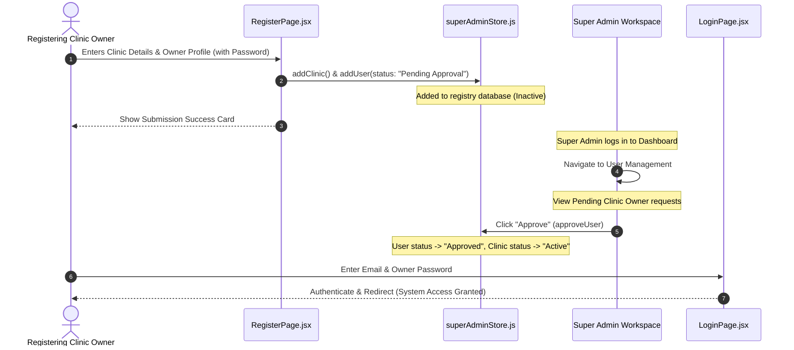

# HMS SaaS: Unified Super Admin Architecture & Access Flow

This document details the updated role-based flows, public entryways, and administrative control panels after simplifying the system.

---

## 🔒 1. System Access Control

To optimize maintenance and licensing, the platform structure has been streamlined. The workspace restricts application menus and routes specifically to **Global Super Admin** control, while other roles utilize the sandboxed registrations.

### Allowed Dashboard Menu Structure (Exactly 7 Modules)
1. **Dashboard (Global):** Central analytics overview showing aggregated collections, active licenses, and resource scores.
2. **Clinics Management:** Add, edit, or remove clinic branch registry records.
3. **User Management:** Manage administrative profiles, set credentials, and approve pending registrations.
4. **Subscriptions:** Manage clinic licensing tiers and configure system plans.
5. **Billing:** Generate invoices, manage bills, and track clinic collections alongside owner contacts.
6. **AI Settings:** Provisions specific AI module toggles (dicom diagnostics, text recall engines) for branches.
7. **Global Reports:** Visual comparison charts showing total practice revenues vs SaaS subscription income.

---

## 🔄 2. External Registration & Approval Sequence

---

## 🧭 3. Page Specifications

### A. Public Entrypoints
- **Landing Page (`/`):** Stripe-inspired presentation of product capabilities. Pricing cards are loaded dynamically from the Zustand pricing plans database.
- **Registration (`/register`):** Allows public registrations. Patients register immediately; Clinic Admins register their branches and owners, entering a pending approval queue.
- **Login (`/login`):** Streamlined entryway for Global Super Admins, linking back to the landing page and registration.

### B. Admin Operations
- **SaaS Plans Configurations:** Located in Subscriptions Management. Allows addition and modification of pricing plans that dynamically update on the marketing page.
- **Associated Owners in Invoices:** Located in the Billing Management table. Dynamically maps name/email contacts next to recurring invoices.
